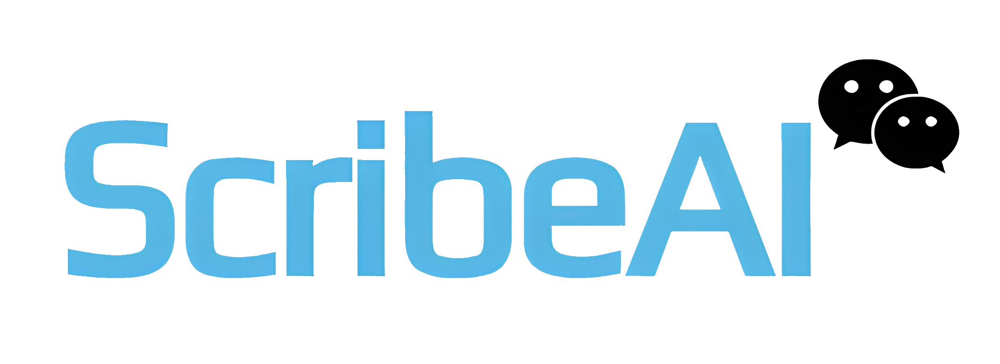

<!-- PROJECT LOGO -->
<br />
<div align="center">
  <a href="https://github.com/uakbr/ScribeAI">
    
  </a>
</div>

<p align="center">
  Revolutionizing healthcare documentation with instant, accurate, on-device medical transcription that lets providers focus on what matters most - patient care.
  <br />
  <a href="https://github.com/username/ScribeAI/issues">Report Bug</a>
  ·
  <a href="https://github.com/username/ScribeAI/issues">Request Feature</a>
</p>

<!-- BADGES -->
<p align="center">
  
  
  
  
  
  
</p>

---

## 📋 Table of Contents

- [Overview](#overview)
- [Key Features](#key-features)
- [Screenshots](#screenshots)
- [Demo Video](#demo-video)
- [Technical Requirements](#technical-requirements)
- [Installation](#installation)
- [Usage](#usage)
- [Directory Structure](#directory-structure)
- [Development Phases](#development-phases)
- [Contributing](#contributing)
- [License](#license)
- [Acknowledgements](#acknowledgements)

---

## 📖 Overview

**ScribeAI** is an advanced iOS application designed for on-device audio transcription using OpenAI's Whisper model, transformed into Core ML format for local processing. It offers private and efficient transcription with continuous background audio recording, leveraging iOS 17’s Dynamic Island and Live Activities to display active status. All transcription processing and storage are handled locally on the device, ensuring a seamless, offline experience.

---

## ✨ Key Features

- **🔍 On-Device Real-Time Transcription**: Transcribe audio without any internet connection using OpenAI's Whisper model.
- **⏺️ Continuous Background Recording**: Record audio even when the app is minimized or the device is locked.
- **🌐 Dynamic Island & Live Activities**: Utilize iOS 17's Dynamic Island and Live Activities to display ongoing recording status and transcription progress.
- **💾 Local Data Management**: Store recordings and transcriptions locally, allowing direct management within the app.
- **🔒 Privacy-Focused**: All data processing is done on-device, ensuring user privacy and data security.
- **📱 Responsive UI/UX**: Designed with a focus on accessibility and responsiveness across all iOS devices.
- **🎨 Customizable Themes**: Choose between Light and Dark modes for optimal viewing.
- **🌍 Multi-Language Support**: Transcribe audio in multiple languages with ease.

---

## 📷 Screenshots

_Note: coming soon._

<p align="center">
  
  
  
</p>

*Recording Screen with real-time transcription, Transcription List, and Transcription View.*

---

## 🎥 Demo Video

_Note: coming soon._

[](https://www.youtube.com/watch?v=YourVideoID)

*Click the image above to watch the demo video.*

---

## 🛠 Technical Requirements

- **Platform**: iOS 17+
- **Programming Language**: Swift 5.5+
- **Xcode**: Version 15 or later
- **Core ML Model**: Pre-converted Whisper model in Core ML format

---

## 🚀 Installation

### Prerequisites

- **Xcode 15** or later installed on your Mac.
- **Swift**: Latest stable version compatible with iOS 17+.
- **Whisper Model**: Pre-converted to Core ML format using the provided Python script.
- **Swift Package Manager** (for handling dependencies).

### Steps

1. **Clone the repository**:
   ```bash
   git clone https://github.com/username/ScribeAI.git
   ```

2. **Navigate to the project directory**:
   ```bash
   cd ScribeAI
   ```

3. **Open the Project in Xcode**:

   - Open `ScribeAI.xcodeproj` in Xcode.

4. **Resolve Swift Package Dependencies**:

   - Xcode should automatically resolve SPM dependencies when you open the project.
   - If not, go to **File > Packages > Resolve Package Versions** in Xcode.

5. **Obtain the Whisper Core ML Model**:

   - Use the provided Python script `ModelConversionScripts/convert_whisper_to_coreml.py` to convert the Whisper model to Core ML format.
   - Place the converted `WhisperModel.mlmodel` into the `Models/` directory.

6. **Update Project Settings**:

   - Set the **Team** under **Signing & Capabilities** in Xcode.
   - Ensure that **Background Modes**, **App Groups**, and other necessary capabilities are enabled.

7. **Configure Permissions**:

   - Enable necessary permissions under `Info.plist`:
     - `NSMicrophoneUsageDescription`
     - `NSSpeechRecognitionUsageDescription`
     - `NSSupportsLiveActivities`

8. **Build and Run**:

   - Select your target device or simulator (iOS 17+).
   - Press **Cmd+R** to build and run the app.

---

## 📚 Usage

1. **Launch the App**:

   - Open the app on your iOS device.

2. **Start Recording**:

   - Tap the **Start Recording** button to begin transcription.
   - The app will start transcribing audio in real-time.

3. **Background Recording**:

   - Minimize the app or lock your device; recording continues in the background.
   - Check the Dynamic Island or Lock Screen for live updates.

4. **View Transcriptions**:

   - Access the **Transcriptions** tab to view, search, delete, or share saved transcriptions.

5. **Settings**:

   - Customize app settings according to your preferences.
   - Choose themes, manage privacy settings, and more.

---

## 📂 Directory Structure

```
ScribeAI/
├── AppDelegate.swift
├── SceneDelegate.swift
├── Models/
│ ├── WhisperModel.mlmodel
│ ├── WhisperModelManager.swift
│ └── CoreDataStack.swift
├── Views/
│ ├── RecordingView.swift
│ ├── TranscriptionView.swift
│ ├── TranscriptionListView.swift
│ └── SettingsView.swift
├── ViewModels/
│ ├── RecordingViewModel.swift
│ ├── TranscriptionViewModel.swift
│ └── SettingsViewModel.swift
├── Managers/
│ ├── LiveActivityManager.swift
│ ├── AudioSessionManager.swift
│ └── DynamicIslandController.swift
├── Utilities/
│ ├── ErrorAlertManager.swift
│ ├── AudioProcessor.swift
│ ├── Localizable.swift
│ └── PerformanceMonitor.swift
├── Widgets/
│ └── TranscriptionWidget.swift
├── ModelConversionScripts/
│ └── convert_whisper_to_coreml.py
├── Resources/
│ ├── Assets.xcassets
│ ├── Localizable.strings
│ └── AppIcon.appiconset
├── Tests/
│ ├── ScribeAITests/
│ └── ScribeAIUITests/
├── Info.plist
└── README.md
```

---

## 📜 License

This project is licensed under the MIT License - see the [LICENSE](LICENSE) file for details.

---
