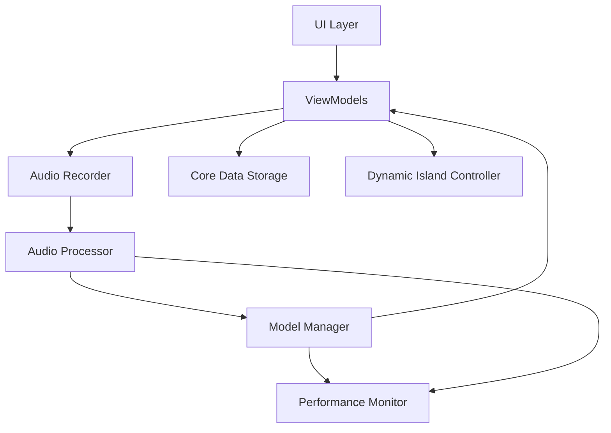

# Building ScribeAI: Real-Time On-Device Medical Transcription for Healthcare Professionals

---

**Table of Contents**

1. [Introduction](#introduction)
   - [Overview of ScribeAI](#overview-of-scribeai)
   - [Motivation Behind the Project](#motivation-behind-the-project)
2. [Understanding the Challenges](#understanding-the-challenges)
   - [Real-Time On-Device Transcription](#real-time-on-device-transcription)
   - [Privacy Considerations in Medical Data](#privacy-considerations-in-medical-data)
   - [Performance Constraints on Mobile Devices](#performance-constraints-on-mobile-devices)
3. [Technology Stack](#technology-stack)
   - [Leveraging OpenAI's Whisper Model](#leveraging-openais-whisper-model)
   - [Integration with Core ML](#integration-with-core-ml)
   - [Utilizing iOS 17 Features](#utilizing-ios-17-features)
4. [Model Conversion and Optimization](#model-conversion-and-optimization)
   - [Converting Whisper Model to Core ML Format](#converting-whisper-model-to-core-ml-format)
   - [Performance Optimizations](#performance-optimizations)
   - [Handling Multi-Language Support](#handling-multi-language-support)
5. [Audio Processing Pipeline](#audio-processing-pipeline)
   - [Audio Recording with AVAudioEngine](#audio-recording-with-avaudioengine)
   - [Real-Time Audio Processing Techniques](#real-time-audio-processing-techniques)
   - [Ensuring Low Latency and High Accuracy](#ensuring-low-latency-and-high-accuracy)
6. [Implementation Details](#implementation-details)
   - [Architectural Overview](#architectural-overview)
   - [Core Components and Their Interactions](#core-components-and-their-interactions)
   - [Managing Background Recording and Transcription](#managing-background-recording-and-transcription)
7. [User Interface and Experience](#user-interface-and-experience)
   - [Designing for Healthcare Professionals](#designing-for-healthcare-professionals)
   - [Accessibility and Ease of Use](#accessibility-and-ease-of-use)
   - [Dynamic Island and Live Activities Integration](#dynamic-island-and-live-activities-integration)
8. [Data Management and Privacy](#data-management-and-privacy)
   - [Local Storage with Core Data](#local-storage-with-core-data)
   - [Encryption and Security Measures](#encryption-and-security-measures)
   - [Compliance with Healthcare Data Regulations](#compliance-with-healthcare-data-regulations)
9. [Performance Monitoring](#performance-monitoring)
   - [Implementing Performance Metrics](#implementing-performance-metrics)
   - [Optimizing for Battery Consumption and CPU Usage](#optimizing-for-battery-consumption-and-cpu-usage)
10. [Testing and Quality Assurance](#testing-and-quality-assurance)
    - [Unit Testing and UI Testing Strategies](#unit-testing-and-ui-testing-strategies)
    - [Handling Edge Cases and Errors](#handling-edge-cases-and-errors)
    - [Beta Testing with Healthcare Providers](#beta-testing-with-healthcare-providers)
11. [Challenges Faced and Solutions Implemented](#challenges-faced-and-solutions-implemented)
    - [Overcoming Model Size and Resource Limitations](#overcoming-model-size-and-resource-limitations)
    - [Dealing with Ambient Noise and Audio Quality](#dealing-with-ambient-noise-and-audio-quality)
    - [Ensuring Compatibility Across Devices](#ensuring-compatibility-across-devices)
12. [Future Work and Enhancements](#future-work-and-enhancements)
    - [Cloud Synchronization and Backup](#cloud-synchronization-and-backup)
    - [Expansion to Other Platforms](#expansion-to-other-platforms)
    - [Advanced Features](#advanced-features)
13. [Conclusion](#conclusion)
    - [Reflections on the Development Process](#reflections-on-the-development-process)
    - [Impact on Healthcare Documentation](#impact-on-healthcare-documentation)
    - [Invitation for Collaboration and Feedback](#invitation-for-collaboration-and-feedback)

---

## Introduction

### Overview of ScribeAI

**ScribeAI** is an advanced iOS application that brings real-time, on-device medical transcription to healthcare professionals. Utilizing OpenAI's Whisper model converted into Core ML format, ScribeAI allows providers to transcribe patient interactions directly on their devices without relying on internet connectivity. By leveraging iOS 17's latest features, including Dynamic Island and Live Activities, ScribeAI offers seamless integration into the healthcare workflow, ensuring providers can focus on patient care without worrying about documentation.

### Motivation Behind the Project

In the fast-paced healthcare environment, providers often struggle with the administrative burden of documentation, which can detract from patient interaction time. Existing transcription solutions often require internet connectivity, raising concerns about data privacy, especially with sensitive medical information. ScribeAI was developed to address these challenges by providing:

- **Privacy-Preserving Transcription**: All data processing occurs locally on the device, ensuring patient data remains secure.
- **Real-Time Documentation**: Immediate transcription allows for instant review and editing, improving accuracy and efficiency.
- **Seamless Workflow Integration**: Built with healthcare professionals in mind, the app integrates smoothly into existing routines.

---

## Understanding the Challenges

### Real-Time On-Device Transcription

Achieving real-time transcription on a mobile device is computationally intensive. The challenge lies in processing audio input quickly enough to provide immediate feedback without compromising accuracy.

### Privacy Considerations in Medical Data

Handling medical data requires strict compliance with privacy regulations like HIPAA. Ensuring that sensitive information does not leave the device is paramount.

### Performance Constraints on Mobile Devices

Mobile devices have limited resources compared to desktop computers. Optimizing the application's performance to run smoothly without draining the battery or overheating the device is crucial.

---

## Technology Stack

### Leveraging OpenAI's Whisper Model

The Whisper model by OpenAI is a state-of-the-art speech recognition system capable of handling multiple languages and providing high accuracy even in noisy environments. By harnessing this model, ScribeAI can offer robust transcription capabilities.

### Integration with Core ML

Apple's Core ML framework allows machine learning models to run efficiently on iOS devices. Converting the Whisper model to Core ML format enables on-device inference, ensuring data privacy and low-latency responses.

### Utilizing iOS 17 Features

ScribeAI takes advantage of the latest iOS 17 features:

- **Dynamic Island**: Displays ongoing recording status and transcription progress, providing users with quick access and control.
- **Live Activities**: Keeps users informed about the app's state, even when it's running in the background.

---

## Model Conversion and Optimization

### Converting Whisper Model to Core ML Format

To run the Whisper model on iOS devices, we needed to convert it from PyTorch to Core ML. We used the following steps:

1. **Load the Pre-Trained Model**: Using the `whisper` library to load the base model.

2. **Trace the Model with Dummy Input**: Prepare a dummy input to match the expected input size of the model.

3. **Convert to Core ML Model**: Use `coremltools` to convert the traced model:
   ```python
   mlmodel = ct.convert(
       traced_model,
       inputs=[ct.TensorType(shape=input_shape)],
       convert_to="mlprogram",
       minimum_deployment_target=ct.target.iOS17,
   )   ```

4. **Save the Core ML Model**: Store the model in the app's resources for deployment.

### Performance Optimizations

- **Model Quantization**: Applied quantization techniques to reduce the model size without significantly affecting accuracy.
- **Computational Graph Optimization**: Simplified the model's computational graph to improve inference speed.
- **Efficient Memory Management**: Managed memory allocation to prevent spikes that could lead to app termination.

### Handling Multi-Language Support

The Whisper model inherently supports multiple languages. However:

- **Language Detection**: Implemented automatic language detection to streamline the user experience.
- **Custom Language Models**: Allowed users to prioritize certain languages for improved accuracy in multilingual environments.

---

## Audio Processing Pipeline

### Audio Recording with AVAudioEngine

We used `AVAudioEngine` to capture audio input:

- **Realtime Audio Capture**: Leveraged input nodes to receive audio samples in real-time.
- **Background Recording**: Configured the audio session to allow recording when the app is in the background.

### Real-Time Audio Processing Techniques

- **Buffer Management**: Implemented a circular buffer to handle continuous audio streams.
- **Signal Processing**: Applied preprocessing steps such as normalization and noise suppression.

### Ensuring Low Latency and High Accuracy

- **Efficient Audio Encoding**: Converted audio samples to the format expected by the model with minimal overhead.
- **Batch Processing**: Processed audio in manageable chunks to balance latency and resource usage.

---

## Implementation Details

### Architectural Overview

The application's architecture follows a modular design, allowing for maintainability and scalability.



### Core Components and Their Interactions

- **UI Layer**: Comprises SwiftUI views and view controllers that present the interface.
- **ViewModels**: Handle the business logic and state management.
- **Audio Recorder**: Captures audio input using `AVAudioEngine`.
- **Audio Processor**: Preprocesses audio data for the model.
- **Model Manager**: Loads and runs the Core ML model for transcription.
- **Core Data Storage**: Manages local storage of transcriptions and recordings.
- **Dynamic Island Controller**: Updates the UI elements displayed in the Dynamic Island.
- **Performance Monitor**: Logs and analyzes performance metrics.

### Managing Background Recording and Transcription

- Configured the app to support background audio modes.
- Implemented proper session management to handle interruptions and audio route changes.
- Used background tasks to continue transcription when the app is not active.

---

## User Interface and Experience

### Designing for Healthcare Professionals

- **Simplified Interface**: Minimalist design to reduce distractions.
- **Quick Actions**: Placed essential functions within easy reach.
- **Relevant Information Display**: Focused on displaying the transcription and recording status prominently.

### Accessibility and Ease of Use

- **VoiceOver Support**: Ensured all elements are accessible via VoiceOver for users with visual impairments.
- **Dynamic Type**: Supported dynamic text sizing for better readability.
- **Color Contrast**: Used high-contrast color schemes suitable for various lighting conditions in healthcare settings.

### Dynamic Island and Live Activities Integration

- **Real-Time Updates**: Displayed recording duration and transcription snippets.
- **User Controls**: Provided quick access to pause or stop recording.
- **Notifications**: Alerted users of important events, such as storage limits or errors.

---

## Data Management and Privacy

### Local Storage with Core Data

Implemented `CoreDataStack` for efficient local data management:

```swift
class CoreDataStack {
    static let shared = CoreDataStack()
    // Persistent container and context setup
    func saveContext() {
        // Save implementation
    }
    func fetchTranscriptions(limit: Int = 0) -> [TranscriptionRecord] {
        // Fetch implementation
    }
}
```

### Encryption and Security Measures

- **Data Encryption**: Encrypted sensitive data at rest using iOS's built-in encryption.
- **Secure Coding Practices**: Prevented injection attacks and unauthorized access.

### Compliance with Healthcare Data Regulations

- **HIPAA Compliance**: Ensured that the app adheres to HIPAA regulations by keeping all PHI (Protected Health Information) on-device.
- **No Network Transmission**: Disallowed any transmission of transcription data over the network.

---

## Performance Monitoring

### Implementing Performance Metrics

Utilized `os.log` and `OSSignpost` for logging and performance tracing:

```swift
class ModelPerformanceMonitor {
    static let shared = ModelPerformanceMonitor()
    private let logger = Logger(subsystem: Bundle.main.bundleIdentifier!, category: "ModelPerformance")
    func logMetrics(duration: TimeInterval, audioLength: TimeInterval) {
        // Logging implementation
    }
}
```

### Optimizing for Battery Consumption and CPU Usage

- **Energy Efficient Coding**: Prioritized low-energy APIs and avoided unnecessary processing.
- **Adaptive Scheduling**: Adjusted processing based on device resources and thermal state.

---

## Testing and Quality Assurance

### Unit Testing and UI Testing Strategies

- **Automated Tests**: Wrote unit tests for core components and UI tests for user flows.
- **Continuous Integration**: Integrated testing into the CI/CD pipeline for early detection of issues.

### Handling Edge Cases and Errors

- **Robust Error Handling**: Provided meaningful error messages and recovery options.
- **Network Conditions Simulation**: Tested under various network conditions to ensure stability.

### Beta Testing with Healthcare Providers

- **Feedback Collection**: Gathered insights from actual users in clinical settings.
- **Iterative Improvements**: Applied feedback to enhance usability and functionality.

---

## Challenges Faced and Solutions Implemented

### Overcoming Model Size and Resource Limitations

**Challenge**: The Whisper model is large and resource-intensive.

**Solution**:

- **Model Pruning**: Removed unnecessary components to reduce size.
- **On-Demand Loading**: Loaded model components as needed to save memory.

### Dealing with Ambient Noise and Audio Quality

**Challenge**: Hospitals can be noisy environments.

**Solution**:

- **Noise Suppression**: Integrated preprocessing filters to reduce background noise.
- **Microphone Selection**: Allowed use of external microphones for better audio capture.

### Ensuring Compatibility Across Devices

**Challenge**: Variations in device capabilities.

**Solution**:

- **Dynamic Scaling**: Adjusted processing based on device capabilities.
- **Minimum Requirements**: Set iOS 17 as the baseline to ensure necessary features are available.

---

## Future Work and Enhancements

### Cloud Synchronization and Backup

- **Secure Cloud Storage**: Implement encrypted backups and sync across devices.
- **User Authentication**: Integrate with healthcare authentication systems for secure access.

### Expansion to Other Platforms

- **iPadOS and macOS Support**: Extend functionality to other Apple platforms.
- **Cross-Platform Capabilities**: Explore possibilities with Catalyst or SwiftUI for multi-platform support.

### Advanced Features

- **Voice Commands**: Implement voice controls for hands-free operation.
- **Analytics and Insights**: Provide data analysis tools for transcriptions.
- **Integration with EHR Systems**: Enable direct export to electronic health records.

---

## Conclusion

### Reflections on the Development Process

Developing ScribeAI was a challenging yet rewarding endeavor. Balancing performance, privacy, and usability required careful planning and execution.

### Impact on Healthcare Documentation

By providing a tool that streamlines documentation, ScribeAI aims to reduce burnout among healthcare professionals and improve patient care quality.
